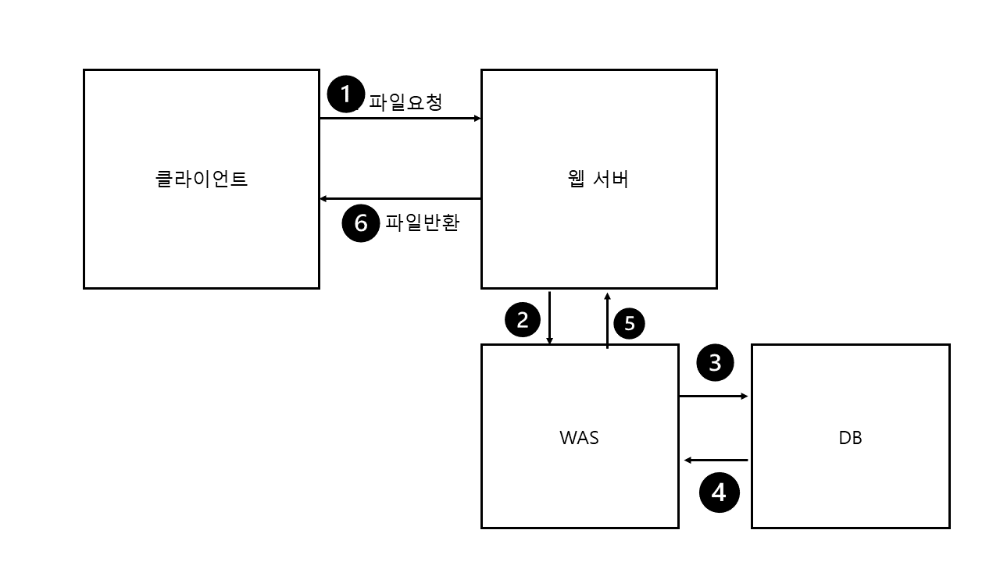

# IT용어 정리

> '개발자가 되기 위해 꼭 알아야 하는 IT용어' 책을 보면서 정리   
     
> 궁금한 IT용어 정리를 찾아보면서 이해할 수 있게 정리
## part1. 웹/ 디자인 
### 웹 서버/ WAS
1. 웹 서버(Web Server) / WAS(Web Appllication Server)의 정의 
- 웹 서버와 WAS는 사용자의 요청을 받아들여 그에 맞는 결과를 사용자에게 전달해주는 프로그램입니다.  

서버는 일반적으로 웹 서버와 WAS, DB로 구성됩니다.
먼저, 클라이언트에서 정적인 콘텐츠를 요청하면 웹 서버에서 해당하는 파일을 클라이언트로 반환하고 요청이 종료됩니다. 
클라이언트에서 동적인 콘텐츠를 요청하는 경우에는 먼저 웹 서버로 요청이 들어오고 웹 서버는 요청을 WAS로 넘겨 줍니다. WAS에서는 다양한 로직을 처리하고 필요한 경우에는 DB를 조회하고 삽입하는 등의 명령을 수행하기도 합니다. WAS에서 로직이 처리되면 해당 페이지를 다시 웹 서버로 전달하고 웹 서버는 마지막으로 클라이언트에게 페이지를 전달합니다. 

## part4. 클라우드/데브옵스
#### 클라우드
1. 클라우드(Cloud)의 정의
클라우드는 인터넷을 통해서 CPU,메모리,데이터 스토리지,네트워크 같은 서비스를 제공하기 위한 컴퓨팅 자원을 제공합니다. 

## 데이터베이스/자료구조 

### 도커

1. 도커의 정의 
도커는 컨테이너에서 다양한 서버의 자원들을 원하는 대로 묶어서 손쉽게 실행하고 배포하는 가상화 플랫폼
